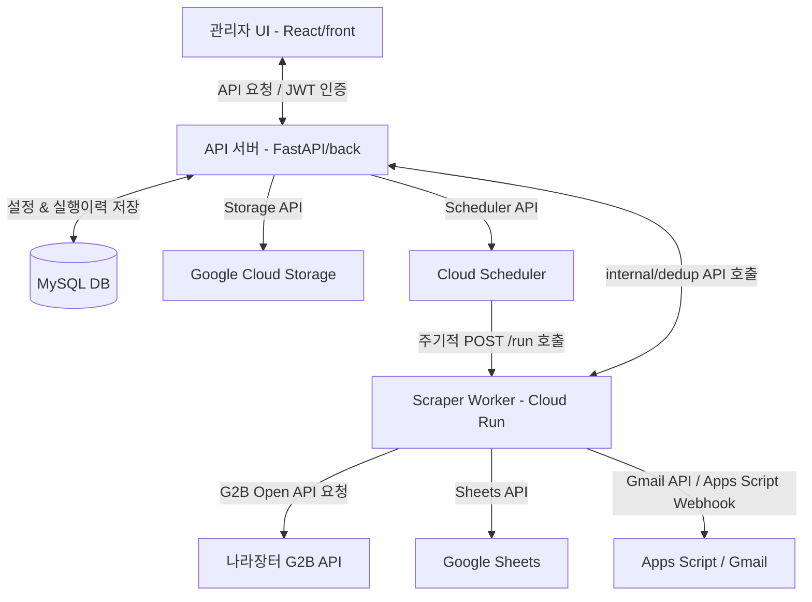

# iCore 통합 사내 업무 플랫폼 (iCore Integrated Platform)

노코드 랜딩 페이지 구축 빌더와 공공데이터포털(나라장터 G2B) API 연동 스크래핑 및 메일/구글 시트 알림 자동화 기능을 제공하는 **사내 통합 업무 플랫폼** 프로젝트입니다.

---

## 1. 전체 아키텍처 개요 및 인프라 흐름

### (1) 외부 트래픽 및 배포 환경
- **프론트엔드 (관리도구)**: React + Ant Design 기반 웹 클라이언트로, 사용자가 템플릿 기반으로 랜딩페이지를 직접 편집하고 배포하며 스크래퍼 동작을 설정할 수 있습니다.
- **백엔드 (API 서버)**: FastAPI로 개발된 파이썬 애플리케이션으로 단일 VM 내부에서 도커 컨테이너로 구동됩니다.
- **데이터베이스**: VM 내부에 로컬 MySQL을 탑재하여 유저 정보, 랜딩페이지 구성 데이터, 스크래퍼 구성 설정값 및 실행 이력을 관리합니다.
- **GCS (Google Cloud Storage)**: 노코드 빌더로 완성된 정적 HTML 파일과 업로드된 자산(이미지 등)이 GCS 버킷에 바로 배포되며, `Cloud CDN` + `Cloud DNS` + `HTTP(S) Load Balancer`를 결합하여 사용자들에게 지연 시간 없이 안정적으로 서비스됩니다.

### (2) 스크래퍼 파이프라인 (자동/주기 실행)
1. **설정 동기화**: 관리자가 UI에서 스크래퍼 실행 설정(알림 시각, 키워드, 메일 등)을 저장하면 백엔드 서버가 DB(`scraper_configs` 테이블)에 쓰고 **Google Cloud Scheduler**의 Cron Job(`icore-g2b-scraper-job-index`)을 실시간으로 업데이트/활성화/일시정지합니다.
2. **트리거**: 지정된 시각이 되면 Cloud Scheduler가 **Google Cloud Run**의 스크래퍼 워커(`g2b_worker`) 엔드포인트 `/run`을 HTTPS POST로 호출합니다.
3. **수집**: 워커가 설정에 지정된 검색 키워드를 루프 돌면서 공공데이터포털(나라장터 G2B)의 "입찰공고" 및 "사전규격" API를 직접 호출하여 최근 윈도우(마지막 성공 실행 시점 ~ 현재 시각) 사이의 공고 후보군을 가져옵니다.
4. **중복 필터링**: 워커가 API 서버의 `/api/scraper/internal/dedup`을 호출하여 DB 내에 이미 존재하는 `dedup_key` (공고 ID 또는 제목의 SHA1 해시값)와 중복되거나, 이전에 발행된(published_at <= last_run_at) 건을 걸러내고 순수 신규 공고만 남깁니다.
5. **적재**: 워커가 구글 시트 API (`Sheets API`)를 사용하여 설정된 구글 스프레드시트의 `나라장터 공고 수집 목록` 및 `나라장터 사전 규격 수집 목록` 시트 탭에 순수 신규 공고 리스트를 덧붙입니다. 이때 회차(`run_no`)를 자동 산출하여 빈 줄 구분과 함께 서식(배경색, 시간 포맷, Hyperlink 보기 수식 등)을 깔끔하게 반영합니다.
6. **알림**: 워커가 Gmail API(도메인 권한 위임 활용)를 사용하여 설정된 메일 주소들로 Bcc 형태의 요약 이메일(HTML 테이블 포맷)을 발송하며, 또는 설정된 Apps Script 웹훅을 호출하여 메일 트리거를 수행합니다.
7. **리포트**: 작업이 완료되면 워커가 API 서버의 `/api/scraper/runs` 엔드포인트에 성공/부분성공/실패 상태와 스크랩 세부 수치(총 수집 건수, 중복제외 건수 등) 및 에러 로그를 전송하여 실행 이력을 기록합니다.

---

## 2. 디렉토리 구조 및 주요 파일 기능 상세

각각의 폴더는 마이크로서비스/멀티 모듈 구조로 독립적으로 작성되어 있으며, 상세 내역은 아래와 같습니다:

### [ROOT] (c:\Users\User\Desktop\icore)
- [package.json](file:///c:/Users/User/Desktop/icore/package.json): 최상위 패키지 설정.
- [migration.sql](file:///c:/Users/User/Desktop/icore/migration.sql) / [migration2.sql](file:///c:/Users/User/Desktop/icore/migration2.sql): DB 스키마 마이그레이션용 보조 SQL 쿼리문.

### 1) 백엔드 모듈 (c:\Users\User\Desktop\icore\back)
FastAPI를 활용한 API 웹 서비스 엔진입니다. GCS 및 Cloud Scheduler 제어 라이브러리를 포함합니다.

#### 주요 스크립트 및 디렉토리
- [main.py](file:///c:/Users/User/Desktop/icore/back/main.py): 서버 진입점. 미들웨어 설정(CORS 허용) 및 API 라우터 등록. 서버 기동 시 DB 테이블 생성 및 `seed_defaults` 구동.
- [app/core/config.py](file:///c:/Users/User/Desktop/icore/back/app/core/config.py): Pydantic `Settings` 기반 설정 관리. DB URL, GCP 리소스 정보, GCS 버킷명, 인증 비밀키, 구글 시트 및 메일 서버 환경변수 매핑.
- [app/schemas.py](file:///c:/Users/User/Desktop/icore/back/app/schemas.py): API 전반에 쓰이는 Pydantic 모델 모음 (DeployRequest, ScraperConfig, ScraperNotice, User 등).
- **데이터 레이어 ([app/data/](file:///c:/Users/User/Desktop/icore/back/app/data))**
  - [database.py](file:///c:/Users/User/Desktop/icore/back/app/data/database.py): SQLAlchemy 엔진 및 `SessionLocal` 구성, DB 세션 의존성 주입용 `get_db` 구현.
  - [models.py](file:///c:/Users/User/Desktop/icore/back/app/data/models.py): SQLAlchemy 기반 테이블 모델 정의.
    1. `LandingTemplateModel` (`landing_templates`): 랜딩 템플릿 메타정보 (ID, 이름, 설명, 미리보기 스타일).
    2. `LandingPageModel` (`landing_pages`): 배포된 랜딩 페이지의 모든 텍스트, 설정색, 구조화 데이터 JSON 문자열(features, stats, curriculum, faqs 등), 만료 시각, 노출 유무.
    3. `ScraperConfigModel` (`scraper_configs`): 수집기 전역 활성화 여부, 콤마 구분 알림 시각 목록, 수신자 이메일, 키워드 목록.
    4. `ScraperRunModel` (`scraper_runs`): 수집기 배치 실행 건별 수행 리포트 (성공률, 수집 건수, 전송 실패 로그 등).
    5. `ScraperNoticeModel` (`scraper_notices`): 영구 중복 수집을 방지하기 위한 공고 목록 저장소 (`dedup_key` 유니크 키 관리).
    6. `UserModel` (`users`): 시스템 어드민 계정 정보 및 패스워드 솔트/해시.
  - [bootstrap.py](file:///c:/Users/User/Desktop/icore/back/app/data/bootstrap.py): 서버가 켜질 때 초기 템플릿(3종) 생성, 기본 관리자 계정(`admin`/`icore1234!`), 기본 스크래퍼 수집 설정값(`클라우드,AI,교육`) 시딩 로직.
- **컨트롤러/라우터 레이어 ([app/routers/](file:///c:/Users/User/Desktop/icore/back/app/routers))**
  - [health.py](file:///c:/Users/User/Desktop/icore/back/app/routers/health.py): `GET /api/health` 제공.
  - [auth.py](file:///c:/Users/User/Desktop/icore/back/app/routers/auth.py): `POST /api/auth/login` 로그인 및 JWT 토큰 반환.
  - [builder.py](file:///c:/Users/User/Desktop/icore/back/app/routers/builder.py): `GET /templates`, `GET /templates/{id}`, `POST /deploy` 랜딩 빌더 지원 API.
  - [site_manager.py](file:///c:/Users/User/Desktop/icore/back/app/routers/site_manager.py): 생성된 랜딩 페이지 조회(`GET /sites`), 수정(`PUT /{id}`), 삭제(`DELETE /{id}`).
  - [scraper.py](file:///c:/Users/User/Desktop/icore/back/app/routers/scraper.py): 수집기 설정 조회/저장, 즉시 실행 트리거, 실행 기록 조회, 내부 스크래퍼 워커(Cloud Run)를 위한 전용 API (dedup 중복 검사, 실행 결과 POST).
- **서비스 레이어 ([app/services/](file:///c:/Users/User/Desktop/icore/back/app/services))**
  - [auth_service.py](file:///c:/Users/User/Desktop/icore/back/app/services/auth_service.py): 외부 종속성 최소화를 위해 직접 구현한 HMAC-SHA256 기반의 토큰 발행/검증, 어드민 권한 체크(`require_auth`), 스크래퍼 토큰 체크(`verify_scraper_internal_token`).
  - [cloud_scheduler_service.py](file:///c:/Users/User/Desktop/icore/back/app/services/cloud_scheduler_service.py): Google Cloud Scheduler API 연동 서비스. 사용자가 등록한 N개의 알림 시각 목록에 따라 각각 `-1`, `-2` 접미사를 붙여 Cloud Scheduler Job을 생성/수정하며 미사용 Job을 제거하고 활성/일시정지 상태 동기화.
  - [platform_service.py](file:///c:/Users/User/Desktop/icore/back/app/services/platform_service.py): 전체 프로젝트에서 비즈니스 로직 밀도가 가장 높은 파일(105KB).
    - 랜딩 페이지 템플릿(캠페인, 다크 테마, 모집 강조형)별 HTML 렌더링 함수(`_render_clean_campaign`, `_render_dark_product`, `_render_event_highlight`).
    - 업로드된 이미지를 GCS에 `.png` 파일로 변환 저장하고 정적 배포하는 기능.
    - 데이터베이스 조회 및 마케팅 자산 생성 제어.
    - 스크래핑된 공고 목록에 대해 `published_at <= last_run_at` 검사 및 `dedup_key` 대조를 통한 중복 필터링 로직 구현.
    - API 서버가 VM 내에서 직접 나라장터를 긁어서 시트에 넣고 메일을 쏠 수 있는 독립적인 단일 수동 파이프라인(`run_scraper_pipeline`) 내장.

### 2) 프론트엔드 어드민 앱 (c:\Users\User\Desktop\icore\front)
React + Vite + Ant Design 환경으로 설계된 반응형 웹 SPA 어드민 제어 센터입니다.

- [vite.config.js](file:///c:/Users/User/Desktop/icore/front/vite.config.js): 빌더 포트 및 proxy 설정을 위한 Vite 번들러 세팅.
- [src/main.jsx](file:///c:/Users/User/Desktop/icore/front/src/main.jsx): React 애플리케이션 진입 노드 마운트.
- [src/App.jsx](file:///c:/Users/User/Desktop/icore/front/src/App.jsx): 전역 인증 여부에 따른 라우팅 제어 (미인증 시 로그인 화면 노출, 인증 시 레이아웃 셸과 각 페이지 전환 제어).
- [src/api/client.js](file:///c:/Users/User/Desktop/icore/front/src/api/client.js): Axios 인스턴스 설정. 요청 헤더에 로컬스토리지 Bearer JWT 토큰을 매번 주입. 백엔드 통신용 매퍼 함수들 정의.
- [src/components/LayoutShell.jsx](file:///c:/Users/User/Desktop/icore/front/src/components/LayoutShell.jsx): 사이드바가 있는 대시보드 셸 UI 구성.
- [src/config/menuConfig.js](file:///c:/Users/User/Desktop/icore/front/src/config/menuConfig.js): 사이드바 메뉴 정의 및 각 메뉴 설명 데이터.
- **페이지 컴포넌트 ([src/pages/](file:///c:/Users/User/Desktop/icore/front/src/pages))**
  - [LoginPage.jsx](file:///c:/Users/User/Desktop/icore/front/src/pages/LoginPage.jsx): 아이디/패스워드 입력 Form 및 Mixed Content 발생 경고 핸들링 기능 탑재.
  - [LandingBuilder.jsx](file:///c:/Users/User/Desktop/icore/front/src/pages/LandingBuilder.jsx): 랜딩 페이지를 동적으로 구성하는 46KB 크기의 컴포넌트.
    1. 템플릿 카탈로그에서 원하는 디자인 선택.
    2. 메인 문구, 대표 이미지 업로드(Base64 인코딩), 추천 대상, 특징 템플릿, 통계 패널 카운트업 항목, 커리큘럼(줄바꿈 구분), 모집 개요 카드, FAQ 아코디언 등을 동적 필드로 작성.
    3. 배포 모달을 띄워 분류 정보, 소분류 정보, 슬러그, 유지 만료 일수, 커스텀 도메인을 기입해 배포 실행.
  - [SiteManager.jsx](file:///c:/Users/User/Desktop/icore/front/src/pages/SiteManager.jsx): 배포된 페이지 테이블 목록. 실시간으로 사이트 도메인 바로가기 가능 및 대주제/소주제, 상태(active/paused/archived) 편집 모달 및 소프트 딜리트 제공.
  - [ScraperControl.jsx](file:///c:/Users/User/Desktop/icore/front/src/pages/ScraperControl.jsx): 수집기 활성화 스위치, 복수 알림 시간 동적 관리(TimePicker 배열), 시트 ID 목록 및 이메일/키워드 태그 관리. 즉시 배치 실행 버튼 및 하단에 실행 이력 모니터링 테이블 렌더링.

### 3) 클라우드 런 스크래퍼 워커 (c:\Users\User\Desktop\icore\back\cloudrun\g2b_worker)
VM 외부인 Google Cloud Run 환경에 별도로 배포되는 분산 스크래퍼 워커 모듈입니다.

- [main.py](file:///c:/Users/User/Desktop/icore/back/cloudrun/g2b_worker/main.py): FastAPI 단일 구조. (53KB)
  - `POST /run`: Cloud Scheduler가 호출하는 메인 진입점.
  - G2B Open API를 연동하여 입찰공고(`bidNtceNm` 파라미터 기반)와 사전규격(`prdctClsfcNoNm` 파라미터 기반)을 병렬로 수집.
  - `/api/scraper/internal/dedup` API를 백엔드로 쏘아 데이터베이스 레벨 중복 제거 수행.
  - 구글 시트 API를 활용하여 스프레드시트 탭(공고 탭, 사전규격 탭)에 데이터 적재. (회차 및 타임스탬프 계산, A1 Range 파싱, 폰트/배경색 리셋 및 특정 구역 포매팅, 보기 하이퍼링크 수식 렌더링).
  - Gmail API (Domain-Wide Impersonation)를 활용하여 수신자 메일로 Bcc 알림 HTML 메일 발송.
  - 최종 완료 및 예외 발생 보고를 백엔드 API 서버의 `POST /runs`로 쏘고 종료.

### 4) 부트캠프 랜딩페이지 리액트 원본 소스 (c:\Users\User\Desktop\icore\bootcamp-landing-page-template)
이 폴더는 노코드 빌더가 생성하는 정적 페이지의 프레임워크가 된 원본 리액트 코드입니다.
- [src/App.tsx](file:///c:/Users/User/Desktop/icore/bootcamp-landing-page-template/src/App.tsx): Framer Motion 애니메이션과 Tailwind CSS 스타일을 차용한 백엔드 개발자 부트캠프 소개용 단일 컴포넌트입니다. 본 코드를 기반으로 노코드 빌더에서 HTML/CSS 파편화 작업을 거친 뒤, 동적으로 데이터 영역(Context)을 갈아 끼워 GCS 정적 파일로 업로드하는 렌더링 엔진(`platform_service.py` 내부 렌더러)이 탄생했습니다.

---

## 3. 핵심 동작 흐름 및 기능 상세 명세

### 1) 노코드 랜딩페이지 렌더링 및 GCS 배포 흐름
- **템플릿 로드**: 백엔드 [platform_service.py](file:///c:/Users/User/Desktop/icore/back/app/services/platform_service.py)의 `get_template_detail`에서 GCS 버킷에 보관된 각 템플릿의 JSON 기본 구조 데이터를 읽어옵니다.
- **이미지 업로드**: 프론트에서 업로드한 이미지(메인 히어로 이미지, 강사 이미지, 커리큘럼 이미지 등)는 base64 문자열로 수신된 후, 백엔드 내부에서 바이너리로 변환되어 GCS 버킷(`landings/{clean_topic}/{slug}/assets/`)에 영구 보존용 파일로 업로드되며, 최종 HTML에는 GCS 웹 링크 URL로 치환되어 꽂힙니다.
- **HTML 조립**:
  - `_build_landing_context` 함수가 입력값(텍스트 문구, 컬러, JSON 데이터 등)을 받아 HTML 전용 특수문자를 이스케이프(`escape()`)합니다.
  - 추천 대상 리스트, 과정 특징 카드들, STEP별 커리큘럼 아코디언, 카운터 통계 태그 등을 동적으로 렌더링해 문자열 변수로 구축합니다.
  - 템플릿별로 미리 준비된 표준 HTML 양식(`_render_clean_campaign` 등)과 합치고, 통계 카운트업 스크립트, 스크롤 페이드인(IntersectionObserver) 스크립트, smooth scroll 스크립트가 내장된 최종 HTML을 완성합니다.
- **배포 및 캐시 제어**: 조립된 HTML 파일은 `landings/{clean_topic}/{slug}/index.html` 경로로 GCS 버킷에 쓰여집니다. 이때, 랜딩페이지 업데이트가 즉각 웹 브라우저에 배포되도록 캐시 컨트롤 헤더를 `no-cache, max-age=0`으로 세팅합니다.

### 2) G2B 나라장터 공고 수집 및 중복 필터링 정책
- **조회 윈도우(Time Window) 결정**:
  - 스크래퍼 워커가 실행되면 우선 API 서버에 `GET /internal/last-run`을 호출하여 가장 최근에 성공한 스크래퍼 배치 시각(`last_run_at`)을 응답받습니다.
  - `inqryBgnDt`는 `last_run_at`으로, `inqryEndDt`는 현재 시각으로 설정하여 그 사이의 공고만 G2B API에서 긁어옵니다. 이력이 없으면 최근 1일(24시간) 간의 윈도우로 작동합니다.
- **XML/JSON 다중 파싱**: 나라장터 API 서버의 불안정한 Content-Type 응답(JSON을 요청했으나 에러 발생 시 XML 바디 또는 에러 코드 XML을 뱉음)에 대응하여, `requests.exceptions.JSONDecodeError` 발생 시 XML 파서(`xml.etree.ElementTree`)로 우회하여 성공 메시지(`resultCode == "00"`)와 결과 데이터를 파싱하도록 예외처리가 매우 촘촘하게 설계되어 있습니다.
- **2단계 중복 필터링**:
  - **1단계 (시간 필터)**: 수집된 공고 중, 발행 시점(`published_at`)이 이전 성공 실행 시각(`since_notified_at`)보다 이전인 경우 필터링하여 버립니다.
  - **2단계 (DB 영구 중복 방지)**: 공고 ID 혹은 제목을 SHA-1 해시로 변환하여 유일한 `dedup_key`를 추출합니다. 이 키가 MySQL DB의 `scraper_notices` 테이블에 존재하는지 쿼리하여 이미 긁어갔던 공고는 수집 리스트에서 즉각 배제합니다.
- **구글 시트 적재 형식**:
  - `_append_to_sheet` 함수가 호출되면, 대상 구글 시트의 A열을 긁어 행 데이터 중 숫자로 표기된 값을 찾아 `최대값 + 1`을 하여 수집 회차(`run_no`)를 생성합니다.
  - 시트 구조가 무한대로 누적되는 데이터 분석에 용이하도록 공고 행들을 밀어넣기 전에 빈 줄(`["", "", "", "", "", ""]`) 한 줄을 깔끔하게 넣고, 그 다음 회차와 시각 행(`[run_no, collected_at, "", "", "", ""]`)을 삽입하여 시인성을 극대화합니다.
  - 공고 본 데이터의 링크 열에는 구글 시트 수식 `=HYPERLINK("공고 링크", "보기")` 형태로 주입하여 링크가 보기 편하게 동작합니다.
  - 적재 완료 후, 새로 추가된 구역에만 batchUpdate API를 사용해 배경색 설정(회차 헤더에 회색 배경 적용) 및 시간 열 서식 고정(실수 타입 시리얼 번호가 노출되는 현상 방지)을 실행합니다.
- **이메일 및 웹훅 통합**:
  - Gmail API의 도메인 위임 자격증명을 활용해 사내 공용 봇 메일 주소로 impersonation하여, 수신자 이메일 목록 전체를 `Bcc`에 담아 각 공고명, 금액, 마감일, 링크가 포함된 깔끔한 HTML 테이블 포맷의 요약 메일을 원클릭으로 송신합니다.

---

## 4. 데이터베이스 엔티티 상세 스펙 및 컬럼 관계

### (1) `landing_templates`
| 컬럼명 | 데이터 타입 | Null 여부 | Key | 기본값 | 특징 |
| :--- | :--- | :--- | :--- | :--- | :--- |
| `id` | VARCHAR(80) | NO | PRI | NULL | PK (예: clean-campaign) |
| `name` | VARCHAR(120) | NO | | NULL | 템플릿 표시 명칭 |
| `description` | VARCHAR(240) | NO | | NULL | 템플릿 간략 설명 |
| `preview_style` | VARCHAR(120) | NO | | NULL | 어드민 미리보기 렌더링용 인라인 CSS 스타일 |

### (2) `landing_pages`
| 컬럼명 | 데이터 타입 | Null 여부 | Key | 기본값 | 특징 |
| :--- | :--- | :--- | :--- | :--- | :--- |
| `id` | VARCHAR(36) | NO | PRI | NULL | PK (UUID 문자열) |
| `template_id` | VARCHAR(80) | NO | | NULL | 템플릿 ID 참조 관계 |
| `business_topic` | VARCHAR(120) | NO | MUL | NULL | 화면 분류 (대주제, INDEX 지정) |
| `business_name` | VARCHAR(120) | NO | | NULL | 화면 이름 (소주제) |
| `major_categories` | TEXT | NO | | NULL | 대분류 목록 (쉼표 구분) |
| `minor_categories` | TEXT | NO | | NULL | 소분류 목록 (쉼표 구분) |
| `slug` | VARCHAR(120) | NO | UNI | NULL | 최종 URL 슬러그 (UNIQUE INDEX 지정) |
| `url` | VARCHAR(500) | NO | | NULL | 배포된 GCS 웹 index.html 경로 링크 |
| `status` | VARCHAR(16) | NO | | active | active, paused, archived 상태 |
| `retention_days` | INT | NO | | 30 | 만료 보존 일수 (기본 30일) |
| `expires_at` | DATETIME(6) | NO | | NULL | 만료 일시 |
| `is_visible` | TINYINT(1) | NO | | 1 | 노출 활성화 여부 |
| `deleted_at` | DATETIME(6) | YES | | NULL | 삭제(archived) 처리 일시 |
| `custom_domain` | VARCHAR(240) | YES | | NULL | 별도 지정 도메인 주소 |
| `title` | VARCHAR(120) | NO | | NULL | 메인 타이틀 문구 |
| `subtitle` | VARCHAR(240) | NO | | NULL | 서브 타이틀 문구 |
| `body` | TEXT | NO | | NULL | 설명 본문 |
| `cta_text` | VARCHAR(60) | NO | | NULL | CTA 버튼 문구 |
| `cta_url` | VARCHAR(240) | NO | | NULL | 대상 링크 |
| `primary_color` | VARCHAR(7) | NO | | NULL | 메인 테마 색상 Hex 코드 (#rrggbb) |
| `secondary_color` | VARCHAR(7) | NO | | NULL | 보조 테마 색상 Hex 코드 |
| `background_color` | VARCHAR(7) | NO | | NULL | 페이지 배경 색상 Hex 코드 |
| `deployed_at` | DATETIME(6) | NO | | NULL | 배포 시각 |
| `created_at` | DATETIME(6) | NO | | CURRENT_TIMESTAMP(6) | 데이터 삽입 타임스탬프 |
| `updated_at` | DATETIME(6) | NO | | CURRENT_TIMESTAMP(6) | 데이터 갱신 타임스탬프 (ON UPDATE) |
| `features_json` | LONGTEXT | NO | | NULL | 과정 특징 목록 JSON 직렬화 문자열 |
| `curriculum_json` | LONGTEXT | NO | | NULL | 커리큘럼 트랙 목록 JSON 직렬화 문자열 |
| `target_audience_json`| LONGTEXT | NO | | NULL | 대상 수강생 리스트 JSON 직렬화 문자열 |
| `stats_json` | LONGTEXT | NO | | NULL | 통계 지표 정보 JSON 직렬화 문자열 |
| `infos_json` | LONGTEXT | NO | | NULL | 모집 개요 카드 정보 JSON 직렬화 문자열 |
| `faqs_json` | LONGTEXT | NO | | NULL | FAQ 아코디언 Q&A JSON 직렬화 문자열 |

### (3) `scraper_configs`
| 컬럼명 | 데이터 타입 | Null 여부 | Key | 기본값 | 특징 |
| :--- | :--- | :--- | :--- | :--- | :--- |
| `id` | INT | NO | PRI | NULL | PK, AUTO_INCREMENT |
| `enabled` | TINYINT(1) | NO | | 1 | 수집 파이프라인 전역 동작 여부 |
| `schedule_mode` | VARCHAR(20) | NO | | daily | 스케줄 주기 모드 (daily 등) |
| `notify_times` | TEXT | NO | | NULL | 수집 수행 시간대 목록 (쉼표 구분) |
| `interval_minutes` | INT | NO | | 60 | 반복 실행 주기 분 단위 값 |
| `dedup_mode` | VARCHAR(40) | NO | | notice_id | 중복 체크 기준 모드 |
| `dedup_retention_hours`| INT | NO | | 48 | 중복 보존 임계 시간 |
| `gsheet_ids` | VARCHAR(255) | YES | | NULL | 대상 구글 시트 ID 목록 (쉼표 구분) |
| `receiver_emails` | TEXT | NO | | NULL | 알림 수신 이메일 목록 (쉼표 구분) |
| `keywords` | TEXT | NO | | NULL | 검색용 키워드 목록 (쉼표 구분) |
| `updated_at` | DATETIME(6) | NO | | CURRENT_TIMESTAMP(6) | 설정 정보 갱신 타임스탬프 (ON UPDATE) |

### (4) `scraper_runs`
| 컬럼명 | 데이터 타입 | Null 여부 | Key | 기본값 | 특징 |
| :--- | :--- | :--- | :--- | :--- | :--- |
| `id` | INT | NO | PRI | NULL | PK, AUTO_INCREMENT |
| `run_id` | VARCHAR(64) | NO | UNI | NULL | 실행 고유 트래킹 ID (UUID4, UNIQUE INDEX 지정) |
| `source` | VARCHAR(20) | NO | | NULL | 호출 출처 (`cloud_run`, `api_server` 등) |
| `status` | VARCHAR(20) | NO | | NULL | `success`, `partial`, `failed` 결과 상태 |
| `keyword_count` | INT | NO | | NULL | 스캔한 키워드 개수 |
| `notice_count` | INT | NO | | NULL | G2B Open API로부터 가져온 원시 공고 개수 |
| `deduped_count` | INT | NO | | NULL | 중복으로 걸러져 제외된 공고 개수 |
| `email_sent_count` | INT | NO | | NULL | 이메일 발송 완료 개수 |
| `sheet_written_count`| INT | NO | | NULL | 구글 스프레드시트에 기입 완료된 행 개수 |
| `error_message` | TEXT | YES | | NULL | 작업 처리 중 예외 발생 시 에러 추적 로그 |
| `executed_at` | DATETIME | NO | | NULL | 배치 실행 시각 |
| `created_at` | DATETIME | NO | | NULL | 데이터 삽입 타임스탬프 |

### (5) `scraper_notices`
| 컬럼명 | 데이터 타입 | Null 여부 | Key | 기본값 | 특징 |
| :--- | :--- | :--- | :--- | :--- | :--- |
| `id` | INT | NO | PRI | NULL | PK, AUTO_INCREMENT |
| `dedup_key` | VARCHAR(190) | NO | UNI | NULL | 중복 체크용 고유 해시 키 (notice_id 또는 title 기반 SHA1) |
| `notice_id` | VARCHAR(160) | NO | | NULL | 나라장터 공고 등록 번호 |
| `title` | VARCHAR(500) | NO | | NULL | 공고 타이틀 명칭 |
| `agency` | VARCHAR(240) | YES | | NULL | 공고 발주 공공 기관명 |
| `estimated_price` | VARCHAR(120) | YES | | NULL | 입찰 추정 금액 |
| `published_at` | DATETIME | YES | | NULL | 공고 공식 게시 일시 |
| `deadline_at` | DATETIME | YES | | NULL | 입찰 마감 시각 |
| `notice_url` | VARCHAR(600) | YES | | NULL | 상세 공고 조회 웹페이지 하이퍼링크 |
| `first_seen_at` | DATETIME | NO | | NULL | 시스템에 최초 수집 감지된 일시 |
| `last_seen_at` | DATETIME | NO | | NULL | 배치 스캐너에 의해 최종 재감지된 일시 |
| `last_run_id` | VARCHAR(64) | YES | | NULL | 가장 최근에 수집을 주도한 `scraper_runs.run_id` |

### (6) `users`
| 컬럼명 | 데이터 타입 | Null 여부 | Key | 기본값 | 특징 |
| :--- | :--- | :--- | :--- | :--- | :--- |
| `id` | INT | NO | PRI | NULL | PK, AUTO_INCREMENT |
| `username` | VARCHAR(100) | NO | UNI | NULL | 로그인용 어드민 아이디 (UNIQUE INDEX) |
| `password_salt` | VARCHAR(64) | NO | | NULL | 비밀번호 단방향 암호화용 고유 랜덤 솔트 |
| `password_hash` | VARCHAR(128) | NO | | NULL | 솔트와 조합하여 해시된 SHA-256 해시값 |
| `role` | VARCHAR(30) | NO | | admin | 어드민 권한 식별자 (기본 `admin`) |
| `is_active` | TINYINT(1) | NO | | 1 | 계정 활성화 여부 |
| `created_at` | DATETIME(6) | NO | | CURRENT_TIMESTAMP(6) | 계정 생성 타임스탬프 |
| `updated_at` | DATETIME(6) | NO | | CURRENT_TIMESTAMP(6) | 계정 수정 타임스탬프 (ON UPDATE) |

---

## 5. TroubleShooting
### 1. Cloud SQL 비용 이슈 및 직접 구축에 따른 DB 환경 관리 문제

- **Problem (문제 상황)**
    - 초기 아키텍처에서는 관리 편의성을 위해 GCP Cloud SQL을 도입했으나, 운영 비용이 예상보다 높게 청구되는 문제가 발생했습니다.
    - 비용 절감을 위해 GCE (VM 인스턴스) 내부에 MySQL을 직접 설치하여 운영하는 방식으로 전환했습니다.
    - 하지만 관리형 서비스가 제공하던 기능들을 직접 제어해야 하면서, **DB 서버의 시간(Timezone) 동기화, 사용자 권한 관리, 초기 테이블 셋업 등의 관리 복잡성이 증가**하는 이슈를 겪었습니다.
- **Solution (해결 방법)**
    - **테이블 관리:** `db-init.sql` 파일을 별도로 작성하여 초기 스키마 셋업과 기초 데이터 삽입 등 필요한 SQL 문을 문서화하고, DB 배포 시 이를 통해 테이블 생성이 자동화되도록 구성했습니다.
    - **DB 시간 관리:** 애플리케이션과 DB 간의 시간 불일치를 막기 위해, 호스트 VM의 OS 타임존을 한국 시간(KST)으로 동기화(`timedatectl set-timezone Asia/Seoul`)하고, MySQL 설정 파일(`my.cnf`)에 `default-time-zone='+09:00'`을 명시하여 데이터 정합성을 확보했습니다.
    - **사용자 관리:** 보안을 위해 `root` 계정의 외부 접근을 차단하고, 애플리케이션에서 접근할 서비스 전용 계정과 관리자용 계정을 분리하여 생성했습니다.

### 2. 메일 자동화 구현 시 Gmail API 연동 및 유지보수성 문제

- **Problem (문제 상황)**
    - 서비스 내 자동 메일 전파 기능을 구현하기 위해 초기에는 Google Apps Script 사용을 고려했습니다.
    - 하지만 Apps Script는 단순 기능 구현에는 용이하나, 추후 애플리케이션 코드와의 통합, 버전 관리 및 유지보수 관점에서는 부적절하다고 판단했습니다.
    - 메일 자동화 구현 시에 방법이 여러 가지 있으나 비즈니스 상황을 고려할 때 선택지를 제거할 필요가 있었습니다.
        1. SendGrid
        2. SMTP 구현
        3. Apps Script 내 호출(Google Sheet 저장과 동시에 Apps Script 함수 호출)
        4. 서비스 계정의 권한 획득 이후 Gmail API를 통한 이메일 전송
        
- **Solution (해결 방법)**
    - GCP Native 환경에서 직접 제어하는 아키텍처로 방향을 수정했습니다.
    - 사내 Google Workspace 도메인 관리자에게 요청하여, 메일 전송을 담당할 GCP 서비스 계정(Service Account)에 Gmail API 전송 권한(Domain-wide Delegation)을 부여받았습니다.
    - 이를 통해 서비스 계정의 JSON Key 인증 방식으로 애플리케이션 단에서 안전하게 인증을 처리하고, 시스템 내에서 내 메일로 자동 전파가 이루어지도록 인프라를 구축했습니다.

### 3. Docker 컨테이너의 동적 IP로 인한 DB 접속 및 인증 실패 문제

- **Problem (문제 상황)**
    - 애플리케이션은 Docker 컨테이너 환경으로 구축하고, DB(MySQL)는 호스트 VM 자체에 설치된 상태로 운영했습니다.
    - 컨테이너 이미지를 수정하고 새로 배포(Push & Run)할 때마다 컨테이너 내부 IP가 계속 동적으로 변경되는 문제가 발생했습니다.
    - 이로 인해 DB 측에서 특정 IP에 대한 접근 권한을 고정할 수 없었고, 컨테이너가 호스트 VM의 DB를 찾지 못해 인증 및 연결이 거부되는 현상이 나타났습니다.
- **Solution (해결 방법)**
    - **Docker 기본 브리지 네트워크 및 Subnet 권한 부여**
    컨테이너에서 호스트로 접근할 때 Docker 기본 게이트웨이 IP(`host.docker.internal`)를 바라보도록 애플리케이션 DB 엔드포인트를 수정했습니다. 또한, MySQL 사용자 권한(Grant) 설정 시 특정 단일 IP가 아닌 Docker 서브넷 대역(`'icore'@'%'`) 전체에 대해 접근을 허용하도록 변경하여, 컨테이너 IP가 동적으로 변경되더라도 유연하게 인증되도록 처리했습니다.
